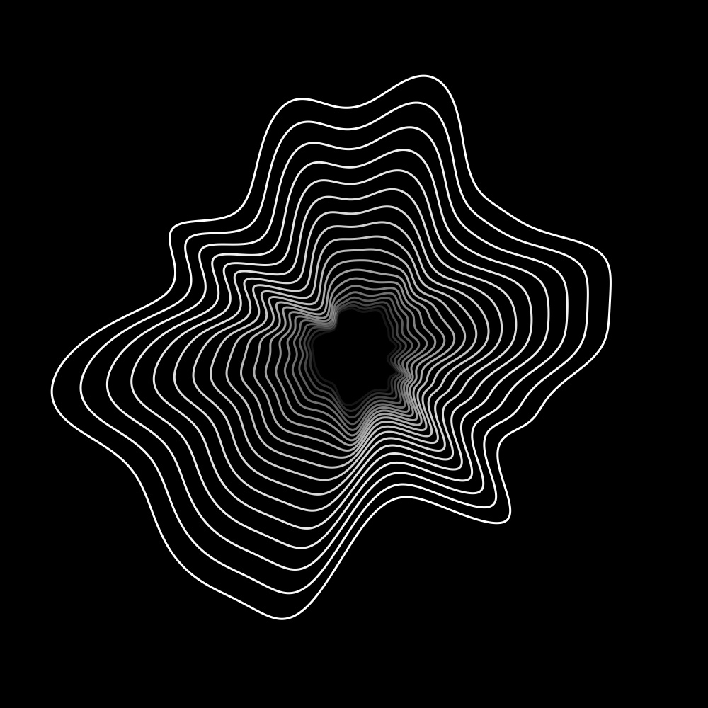
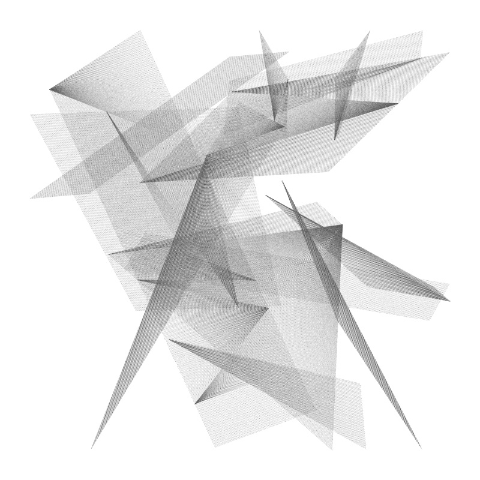

## Numerical Art
Algorithms that serve as a base for creating generative art.

### Implemented
- B-splines
- Hermite splines (taken from [quintic-spline-solver](https://github.com/janhuenermann/quintic-spline-solver))
- Perlin noise
- I/O functions to simplify high-performance drawing in C++ 

Uses cairo as a drawing library, Eigen3 for math, OpenCV for displaying and I/O, and OpenMP for speeding things up.

### Ideas
- [x] Create B-spline circle, randomly mutate control points, clone with perspective transform
- [ ] Init random circles (rand radius), assign them random frequencies, do FT drawing.

### Artworks

> Artwork 01

> Artwork 02

### Inspiration
In some of the artworks, I took huge inspiration from the following sources. Good artists copy, great artists steal. ;)

- [art.daneden.me](https://art.daneden.me/)
- [inconvergent](https://inconvergent.net/generative/)
- [complexification](http://www.complexification.net/gallery/)
- [n-e-r-v-o-u-s](https://n-e-r-v-o-u-s.com)