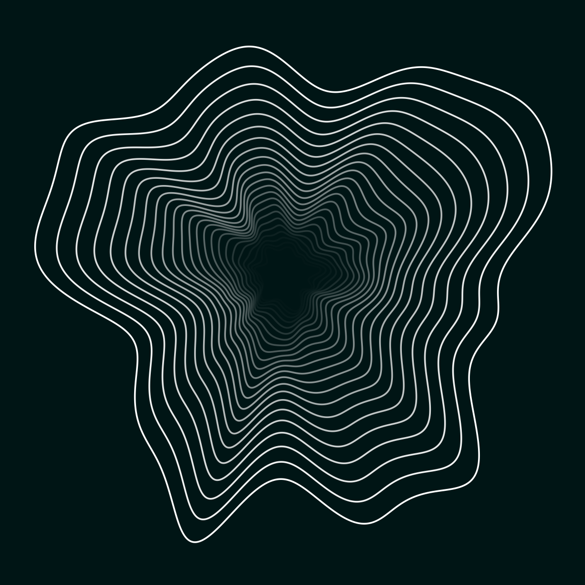

## Numerical Art

### Ideas
- [x] Create B-spline circle, randomly mutate control points, clone with perspective transform
- [ ] Init random circles (rand radius), assign them random frequencies, do FT drawing.

### Artworks

> Artwork 01

> Artwork 02